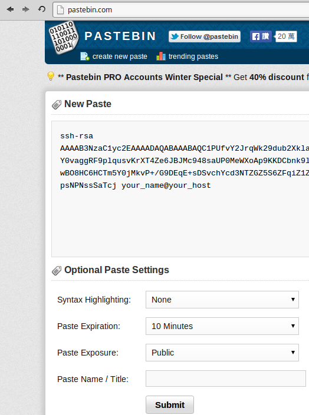
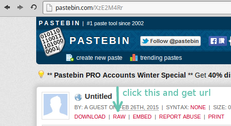

# Install Arch linux

## Make bootable USB

Go to [arch linux download page](https://www.archlinux.org/download/), download the .iso

Copy it to you USB:

    # dd bs=4M if=/path/to/archlinux.iso of=/dev/sdx && sync

`/dev/sdx` is your USB device name.

Please shutdown and boot the computer by the USB

## Partition the disks

layout:

    sdx1: swap          - 2 G
    sdx2: extended      - 100 ~ 200 G
      sdx5:    /        -  25 ~ 200 G
      sdx6~10: other OS -  25 ~ 200 G

Delete all partitions of /dev/sdx
Create `swap`, `extended`, `/` partitions

    # cfdisk /dev/sdx

## Format the partitions

    # mkswap /dev/sdx1
    # mkfs -t ext4 /dev/sdx5

## Mount the partitions

    # mount /dev/sdx5 /mnt

## Connect to the Internet

Check your networks

    # ip addr show

Connect by static ip

    # ip addr flush dev your_device
    # ip addr add your_ip/your_mask dev your_device
    # ip route add default via your_gateway

Setup name server

    # echo nameserver your_nameserver >> /etc/resolv.conf

## Install the base packages

    # pacstrap /mnt base

## Configure the system

    # genfstab -U -p /mnt >> /mnt/etc/fstab
    # arch-chroot /mnt

Set the hostname

    # echo computer_name > /etc/hostname

Set the time zone

    # ln -sf /usr/share/zoneinfo/your_zone/your_subzone /etc/localtime

Uncomment the needed locales in `/etc/locale.gen`, then

    # locale-gen

Set the root password

    # passwd

### Configure Network

Create a configuration file for systemd service

    # vi /etc/conf.d/net-conf-your_interface
    address=your_ip
    netmask=your_mask
    broadcast=your_broadcast
    gateway=your_gateway

Create a network start script

    # vi /usr/local/bin/net-up.sh
    ip link set dev "$1" up
    ip addr add ${address}/${netmask} broadcast ${broadcast} dev "$1"

    [[ -z ${gateway} ]] || { 
      ip route add default via ${gateway}
    }

Create a network stop script

    #!/bin/bash
    ip addr flush dev "$1"
    ip route flush dev "$1"
    ip link set dev "$1" down

Make both scripts executable

    # chmod +x /usr/local/bin/net-{up,down}.sh

Create systemd service file

    # vim /etc/systemd/system/network@.service
    [Unit]
    Description=Network connectivity (%i)
    Wants=network.target
    Before=network.target
    BindsTo=sys-subsystem-net-devices-%i.device
    After=sys-subsystem-net-devices-%i.device
    
    [Service]
    Type=oneshot
    RemainAfterExit=yes
    EnvironmentFile=/etc/conf.d/net-conf-%i
    ExecStart=/usr/local/bin/net-up.sh %i
    ExecStop=/usr/local/bin/net-down.sh %i
    
    [Install]
    WantedBy=multi-user.target

Make it auto run at boot

    # systemctl enable network@your_interface

Setup name server

    # echo nameserver your_nameserver >> /etc/resolv.conf

## Install a bootloader

Install to disk

    # grub-install --target=i386-pc --recheck /dev/sdx
    # grub-mkconfig -o /boot/grub/grub.cfg

## Reboot

Exit the chroot environment

    # exit

Unmount the partition

    # umount /mnt
    # reboot

## User management

Make first user

    # useradd -m your_name
    # passwd your_name

## Setup firwall

    # iptables -N TCP
    # iptables -N UDP
    # iptables -P FORWARD DROP
    # iptables -P OUTPUT ACCEPT
    # iptables -P INPUT DROP
    # iptables -A INPUT -m conntrack --ctstate RELATED,ESTABLISHED -j ACCEPT
    # iptables -A INPUT -i lo -j ACCEPT
    # iptables -A INPUT -m conntrack --ctstate INVALID -j DROP
    # iptables -A INPUT -p icmp --icmp-type 8 -m conntrack --ctstate NEW -j ACCEPT
    # iptables -A INPUT -p udp -m conntrack --ctstate NEW -j UDP
    # iptables -A INPUT -p tcp --syn -m conntrack --ctstate NEW -j TCP
    # iptables -A INPUT -p udp -j REJECT --reject-with icmp-port-unreachable
    # iptables -A INPUT -p tcp -j REJECT --reject-with tcp-rst
    # iptables -A INPUT -j REJECT --reject-with icmp-proto-unreachable
    # iptables-save > /etc/iptables/iptables.rules
    # systemctl enable iptables
    # systemctl start iptables

## Install Docker

    # pacman -S docker
    # systemctl enable docker.service
    # systemctl start docker.service

### Install named

    # docker build -t your_name/named:v1 your_named_directory
    # docker run --name named -d -p 53:53 -P 53:53/udp your_name/named:v1

Add a line

    # vi /etc/iptables/iptables.rules
    -A TCP -i your_interface -p tcp --dport 53 -j ACCEPT

    # iptables-restore < /etc/iptables/iptables.rules

Check if named is listening

    # ss -tulp

Check log

    # docker logs named

Check if works

    # dig your_domain
    # dig your_domain +trace

### Install sshd

    # pacman -S openssh

Configuration

    # vi /etc/ssh/sshd_config
    Port your_prefered_port
    Protocol 2
    HostKey /etc/ssh/ssh_host_xxxxxxxx_key
    PermitRootLogin no
    StrictModes yes
    RSAAuthentication yes
    PubkeyAuthentication yes
    PasswordAuthentication no
    PermitEmptyPasswords no
    UsePAM yes
    Banner none

Add a line

    AllowUsers your_name

Use any service to publish your client public key

I use `http://pastebin.com/` in this example

Back to normal user from root

    # exit

Add user needed authenticated

    $ mkdir ~/.ssh
    $ chmod 700 ~/.ssh
    $ curl http://pastebin.com/raw.php?i=xxyyzz > ~/.ssh/authorized_keys
    $ chmod 600 ~/.ssh/authorized_keys

Log in as root

    # su -

Allow sshd

    # vi /etc/iptables/iptables.rules
    -A TCP -i your_interface -p tcp --dport your_prefered_port -m conntrack --ctstate NEW -m recent --set --name ssh --rsource
    -A TCP -i your_interface -p tcp --dport your_prefered_port -m conntrack --ctstate NEW -m recent ! --rcheck --seconds 60 --hitcount 4 --name ssh --rsource -j ACCEPT

Enable the rules

    # iptables-restore < /etc/iptables/iptables.rule
    # systemctl restart docker.service
    # docker start named

Configure at your client

    $ vi ~/.ssh/config
    Host your_prefered_name
      HostName your_host_ip
      Port     your_prefered_port
      User     your_account_name

Run

    # systemctl enable sshd.service
    # systemctl start sshd.service

Check if sshd is running

    # ss -tulpn

Check if sshd is usable at client

    $ ssh your_prefered_name
